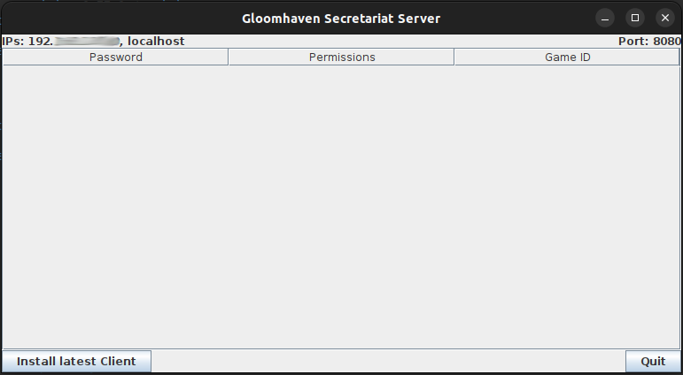
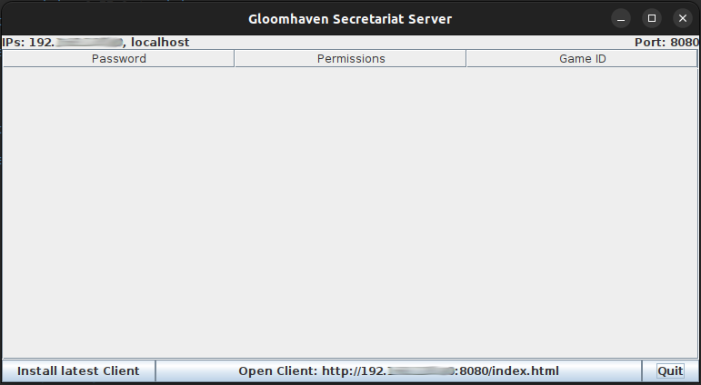

# Gloomhaven Secretariat Server (ghs-server)

[](https://github.com/Lurkars/ghs-server/actions/workflows/deploy.yml) [](https://github.com/Lurkars/ghs-server/actions/workflows/release.yml) [](https://github.com/Lurkars/ghs-server/actions/workflows/publish-docker-image.yml)

This is a server component for the [Gloomhaven Secretariat](https://gloomhaven-secretariat.de) ([Source](https://github.com/Lurkars/gloomhavensecretariat)). It synchronises the game state between all clients via websockets. Access is controlled by specifying a **Game ID** in all messages.

It's a Java application that runs on most systems that run the old [Gloomhaven Helper](http://esotericsoftware.com/gloomhaven-helper) (by [Esoteric Software®](http://esotericsoftware.com)) desktop version. A headless mode is also integrated.

A public server is available at `gloomhaven-secretariat.de` port `8443` with `secure` option. I also maintain a public server list, so please contact me if you'd like to run a public instance yourself.

## Support

☕ [Buy me a coffee?](https://ko-fi.com/lurkars) (or [Donate directly via PayPal](https://paypal.me/Lurkars))

## How to run

This will run a basic server for a single game code (e.g. for a group, you can still use the multi-campaign feature).

### Quickstart

1. Install *Java 17* (or higher) (***Requirement changes with newer version!***) *Runtime Environment*: [Installation Guide for different OS'](https://adoptium.net/en-GB/installation/)
2. Download the appropriate latest `jar` executable (without `-mariadb`- or `-postfix`-suffix) from the [latest release](https://github.com/Lurkars/ghs-server/releases/latest) assets.
3. Execute the `jar` file (should be working automatically with your Java Runtime Environment)
4. You should see a similar window:<br>
	
	> ⚠️ **Important**: If you do not see any local IP address listed besides `localhost`, please check your Firewall settings! After allowing the application in your network and restarting the app, you should see your local IP starting with `192.[...]` in most cases!

5. Click the **Install latest client** button, afterwards window should look like this:<br>
6. On any device in your local network, you should now be able to access the client with the listed address `http://192.[...]:8080/index.html` and connect to your server via `Host: 192.[...]`and `Port: 8080`.
  	
  	> ℹ️ **Notice**: Connecting from a different client running with HTTPS (like [gloomhaven-secretariat.de](https://gloomhaven-secretariat.de)) won't work! If you want the server to be accessbile from HTTPS, see [Enable SSL](#enable-ssl).


All data is stored in `<your-home-folder>/.ghs` ([List of home-folders for different OS'](https://en.wikipedia.org/wiki/Home_directory#Default_home_directory_per_operating_system)). 
If you want to reset the server, just delete the `ghs.sqlite` database file in this directory.

## How to run (advanced)

If you want to configure your server in detail or create a public server, here are some advanced installation and configuration steps.

### Building and running with Docker

If you want to use Docker to run on port 8080, execute the following

```shell
docker pull gloomhavensecretariat/ghs-server
docker run --rm -p 8080:8080 --name ghs-server gloomhavensecretariat/ghs-server
```

If you want to configure the `application.properties` file, replace the `docker run` command with

```shell
docker run --rm -p 8080:8080 -v {local_path}:/root/.ghs --name ghs-server gloomhavensecretariat/ghs-server
```

The `.ghs` folder is now accessible from your `{local_path}`.

For use with docker compose, just run `docker compose up -d`.

### Serve the client

The Server is also able to serve the Client. Simply click on the "Install latest client" button in the GUI. Then you can open the client directly in your browser by clicking on the appropriate button.

If you are running headless, just download the zip file (NOT the source code!) of the [Gloomhaven Secretariat Release](https://github.com/Lurkars/gloomhavensecretariat/releases) and extract it to the folder `<your-home-folder>/.ghs/gloomhavensecretariat`. After that GHS is accessible at `http://{your-ip}:{server-port}` (`http://localhost:8080` with default values). To automatically install the latest client on startup, edit the `application.properties` file in the GHS server configuration folder `<your-home-folder>/.ghs` and add the following line: `ghs-server.lastestClientOnStartup=true`.

### Running headless

To run the server in headless mode, simply set the `-Djava.awt.headless=true` parameter for execution. For example `java -jar ghs-server-*.jar -Djava.awt.headless=true`.

### Change port

To run the server on a different port (default: 8080), edit the `application.properties` file in the GHS server config folder `<your-home-folder>/.ghs` and add the following line: `server.port=<NEW PORT>`.

Replace `<NEW PORT>` with the port of your choice.

### Running public

A public server will accept any **Game Code** and create a game for it. The **Game Code** is therefore more of an identifier for a single game than a password protection. To make a public server, edit the `application.properties` file in the GHS server configuration folder `<your-home-folder>/.ghs` and add the following line: `ghs-server.public=true`.

### Enable SSL

If you want to connect to the server from a client using HTTPS (NOTE: this is not the case if you run your own client locally!), the websocket connection will be upgraded to wss by any modern browser. Therefore, connecting to a server on the local network is only possible if SSL is enabled. A self-signed certificate is already included (yes, including a hardcoded password visible to everyone). So to easily enable SSL, just edit the `application.properties` file in the GHS server configuration folder `<your-home-folder>/.ghs` and add the following line: `server.ssl.enabled=true`. As a self-signed certificate is used, it is untrusted by all modern browsers. To connect, just type `https://{your-ip}:{server-port}` (`https://localhost:8080` with default values) and accept the security warnings. You should then be able to connect using SSL. (This must be done for each client).

To serve with your own certificate, overwrite the following properties in your `application.properties` file

```
server.ssl.key-store-type=
server.ssl.key-store=
server.ssl.key-store-password=
server.ssl.key-alias=
```

To generate a certificate file from your [Let's Encrypt](https://letsencrypt.org/) certificate, use 

```
openssl pkcs12 -export -in fullchain.pem -inkey privkey.pem -CAfile chain.pem -caname root -name ghs-server -out ghs-server.p12
```

This will prompt for a password and then create a `ghs-server.p12` file which will be referenced as `server.ssl.key-store`.


#### Automatic HTTP

When running with SSL, a non-SSL server is automatically available on port `8081`. To change this port, edit the `application.properties` file in the GHS server configuration folder `<your-home-folder>/.ghs` and add the following line: `server.http.port=<HTTP PORT>`.

### Use PostgreSQL/MariaDB

It is possible to replace the sqlite database with a PostgreSQL or MariaDB database. Download the corresponding [artifact](https://github.com/Lurkars/ghs-server/releases/latest) or build your own package with profile `db-postgresql` or `db-mariadb`.

Afterwards, add the following lines to the `application.properties` file in the GHS server configuration folder `<your-home-folder>/.ghs`:

```
# keep those blank
spring.datasource.driverClassName=
spring.jpa.database-platform=

# postgresql: replace <database>, <username> and <password> to your needs, remove *mariadb* lines below
spring.liquibase.change-log=classpath:db/postgresql/main.xml
spring.datasource.url=jdbc:postgresql://localhost/<database>
spring.datasource.username=<username>
spring.datasource.password=<password>

# mariadb: replace <database>, <username> and <password> to your needs, remove *postgresql* lines above
spring.liquibase.change-log=classpath:db/mariadb/main.xml
spring.datasource.url=jdbc:mariadb://localhost:3306/<database>
spring.datasource.username=<username>
spring.datasource.password=<password>
```

### Use as GHS Backup Server

You can also use the server component to be used as GHS Backup Server to accept game payloads and store to file system. The upload url is `http://{your-ip}:{server-port}/backup/{FILENAME}` with `POST` and requires a Token in `Authorization Header` for authorization. To enable, add the following lines to the `application.properties` file in the GHS server configuration folder `<your-home-folder>/.ghs`:


```
# replace <path-to-backup> with an accessible path to store the backup files and <token> as authorization header for authentication.
ghs-server.backup.path=<path-to-backup>
ghs-server.backup.authorization=<token>
```

On client side, enable *Automatic Backups* under *Data Management* and configure with the following

| Parameter            | Value                                              | Description                                                                                                                                                                                                                                                   |
|----------------------|----------------------------------------------------|---------------------------------------------------------------------------------------------------------------------------------------------------------------------------------------------------------------------------------------------------------------|
| Upload url           | `http://{your-ip}:{server-port}/backup/{FILENAME}` | `{FILENAME}` and `{WINDOWS_FILENAME}` (to exclude special characters) are placeholders and get automatically replaced with `ghs-autobackup-<timestamp>.json`. If you choose not to use `{FILENAME}` you must have some filename after the `/backup/` endpoint |
| Method               | POST                                               |                                                                                                                                                                                                                                                               |
| Authorization Header | \<token\>                                          | The token you used in the server's `application.properties` file                                                                                                                                                                                              |

## How to use with GHS

Go to the main menu in Gloomhaven Secretariat (GHS) and click on **Connect to Server**. Enter the IP/Hostname of the server in **Host** (on the same machine just use `localhost`), set **Port** to `8080` (if not changed default port).

When you run the game for the first time, simply select a **Game Code** of your choice. This will create a new game with that **Game Code**. After that, each time you connect to the server, you will need to set the same **Game Code** (it is now unchangeable!). Alternatively, you can make the instance [public](#running-public) to allow multiple games/Game Codes.

## Missing / Coming

- updated GUI (it's more of a placeholder now)
  - add/change/update Game Codes/permissions
- optional: track undo/redo on server too

## Workarounds

- The database is a simple `ghs.sqlite` file in the GHS server config folder `<your-home-folder>/.ghs`. You can manipulate the file directly with `Sqlite`. To reset the database, simply delete the `sqlite` file.
- On startup, all **Game Codes** are written to syslog in clear text. (Can be disabled in the `application.properties` via `ghs-server.gameCodesDump=false`)

## Privacy

This application does NOT collect any personal data other than GHS game state, authentication and permission data. Please note that this data is NOT ENCRYPTED. Be aware that you must trust any third party provider of a server component not to collect any other data such as IP addresses.

## Copyright / License

Gloomhaven and all related properties, images and text are owned by [Cephalofair Games](https://cephalofair.com).

The source code is licensed under [AGPL](/LICENSE)

## Personal disclaimer

This is a hobby project I do in my spare time. The software fills a practical need due to the demise of the original Helper application, so I am following the **Quick'n'Dirty** approach to get things done quickly. This of course leads to a lack of quality and testing and the code base is definitely not in line with my profession.
	 
